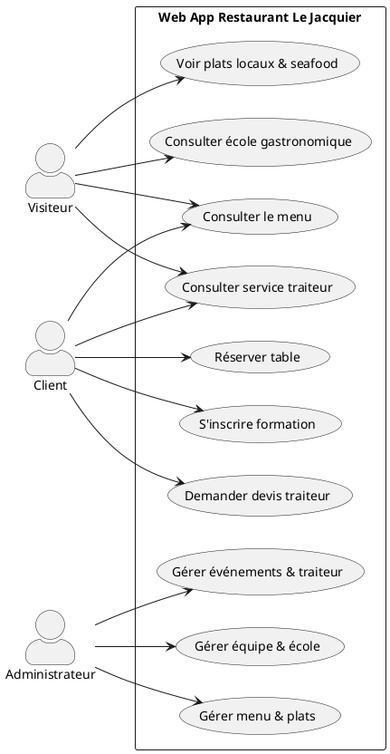
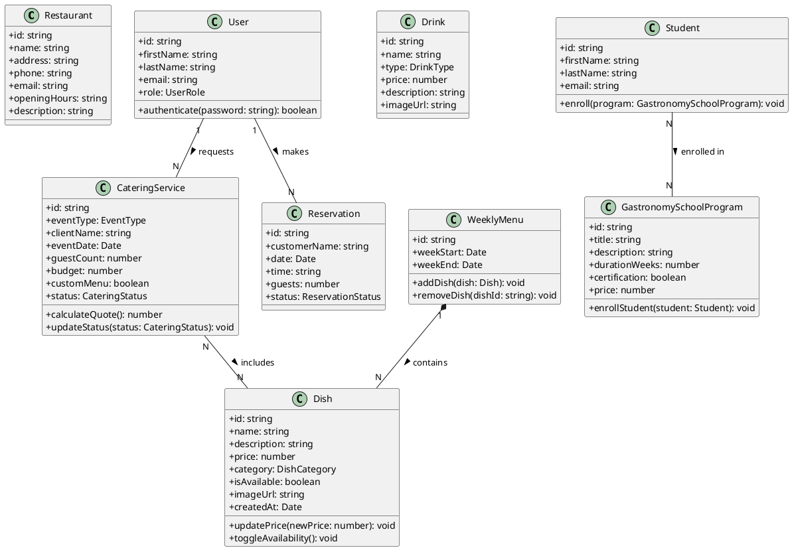
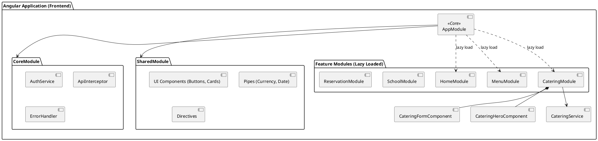
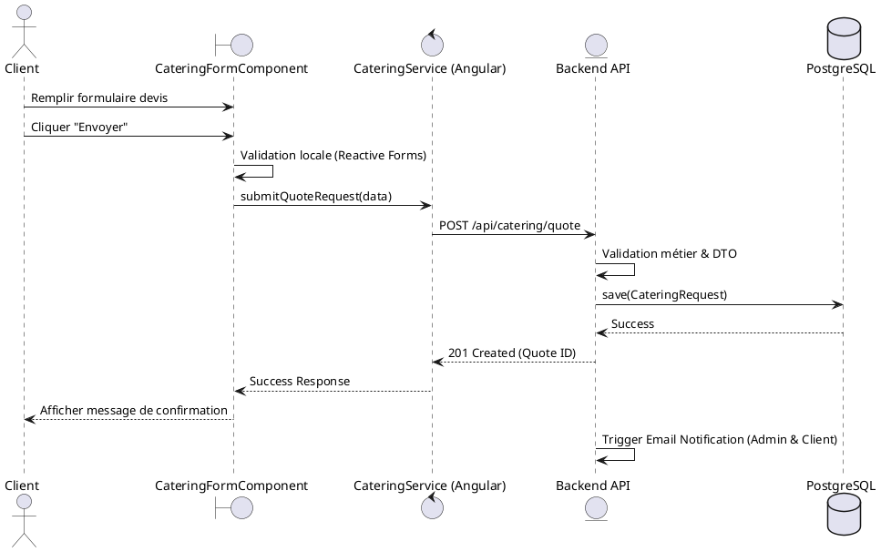
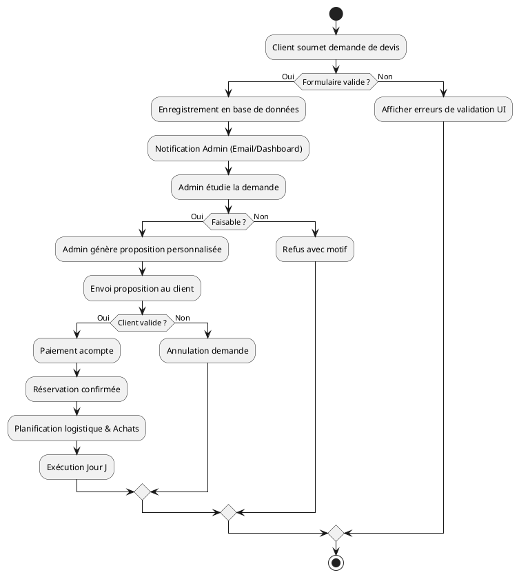
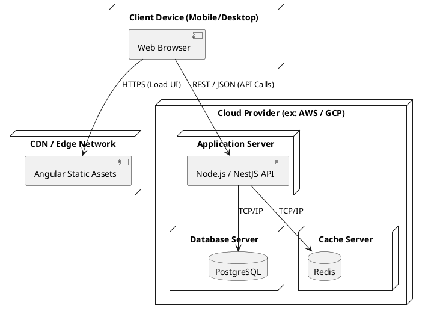
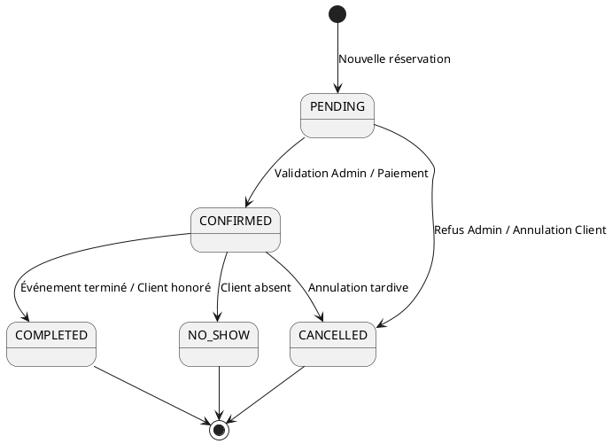

# Architecture UML - Web App Restaurant Le Jacquier

Ce document présente l'architecture complète de l'application web Angular pour le restaurant premium "Le Jacquier", intégrant les services de restauration, traiteur et école de gastronomie.

## 1. Diagramme de Cas d'Utilisation (Use Case)

Ce diagramme illustre les interactions entre les différents acteurs (Visiteur, Client, Administrateur) et le système.

## 2. Diagramme de Classes (Domain Model)

Modélisation orientée objet du domaine métier (Clean Architecture).

## 3. Diagramme de Composants (Architecture Angular)

Structure modulaire et Lazy Loading de l'application Angular.

## 4. Diagramme de Séquence (Demande de Devis Traiteur)

Flux d'exécution lors de la soumission d'une demande de devis.

## 5. Diagramme d'Activité (Processus Traiteur)

Logique métier du cycle de vie d'une prestation traiteur.

## 6. Diagramme de Déploiement

Architecture physique et infrastructure cloud.

## 7. Diagramme d'États (Réservation)

Cycle de vie d'une réservation de table ou de service traiteur.

## Justification Architecturale

1. **Séparation des responsabilités (SOLID)** : Le frontend Angular est strictement séparé de la logique métier complexe (Backend). Les services Angular ne font que de la communication HTTP et de la gestion d'état local (Signals).
2. **Performance (Lazy Loading)** : Les modules comme `CateringModule` ou `SchoolModule` ne sont chargés que lorsque l'utilisateur navigue vers ces routes, réduisant le bundle initial.
3. **Scalabilité** : L'utilisation du pattern Repository sur le backend et de l'injection de dépendances sur Angular permet de faire évoluer l'application (ex: ajout de nouveaux restaurants) sans réécrire le cœur du système.
4. **Sécurité** : L'authentification par JWT et le RBAC (Role Based Access Control) garantissent que seuls les administrateurs peuvent modifier les menus ou valider les devis.
